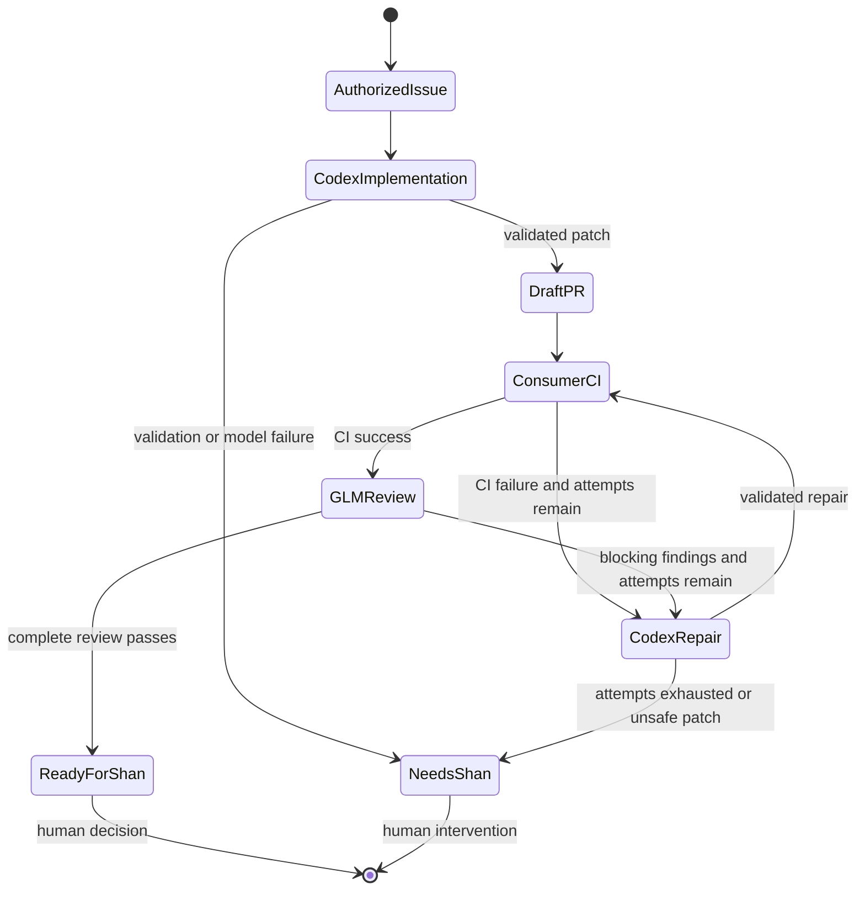

# Shan's AI Software Factory

This repository is a reusable GitHub Actions execution engine for real software projects. It turns a carefully authorized GitHub issue into an isolated implementation branch, runs the consumer repository's own setup and verification commands, opens a draft pull request, supervises CI, requests an independent GLM review of the complete diff, performs bounded repairs with Codex, and stops for human approval.

It is deliberately **not** a SaaS application, dashboard, code generator demo, or auto-merge bot. There is no central database and no shared mutable queue. Each consumer repository remains the authority for its code, CI, branch protection, issues, pull requests, and secrets. Three or thirty repositories can run independently because concurrency is scoped to repository plus task.

## Delivery state machine

## Non-negotiable boundaries

- Codex can edit a workspace but never receives a write-capable GitHub token.
- GLM runs through a pinned, officially supported OpenCode terminal client under a read-only OS identity. It receives the task, exact diff batches, context, and CI evidence; it never runs consumer code or receives a GitHub token.
- Publisher jobs can write branches and pull-request metadata but never receive model API keys.
- Generated patches cannot modify workflows, factory configuration, repository instructions, credentials, submodules, or other protected governance paths.
- A moved branch head, incomplete review coverage, malformed model response, missing secret, failed command, API error, unsupported conclusion, or retry exhaustion blocks progress.
- The factory never merges and never deploys.

## Repository contract

Each consumer installs two thin workflows and one explicit configuration file from `templates/consumer`. Tasks are open issues with `ai:build` and exactly one risk label: `ai:risk:green`, `ai:risk:yellow`, or `ai:risk:red`. `ai:risk:black` is always rejected. Only actors named in the consumer config may authorize a task.

Read [INSTALL_CONSUMER.md](docs/INSTALL_CONSUMER.md), [ARCHITECTURE.md](docs/ARCHITECTURE.md), and [SECURITY_MODEL.md](docs/SECURITY_MODEL.md) before connecting a repository.

## Current acceptance standard

The factory is not considered proven by unit tests alone. Acceptance requires the central workflow checks to pass and live, material tasks in three different consumer repositories to complete the full path: authorization, implementation, project verification, isolated publication, consumer CI, complete GLM review, any required repair, re-verification, and a human-gated final state.
